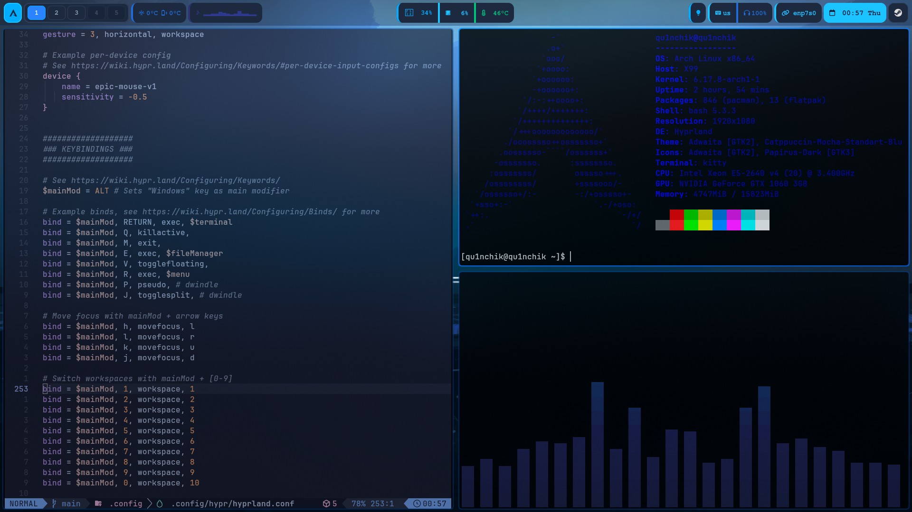
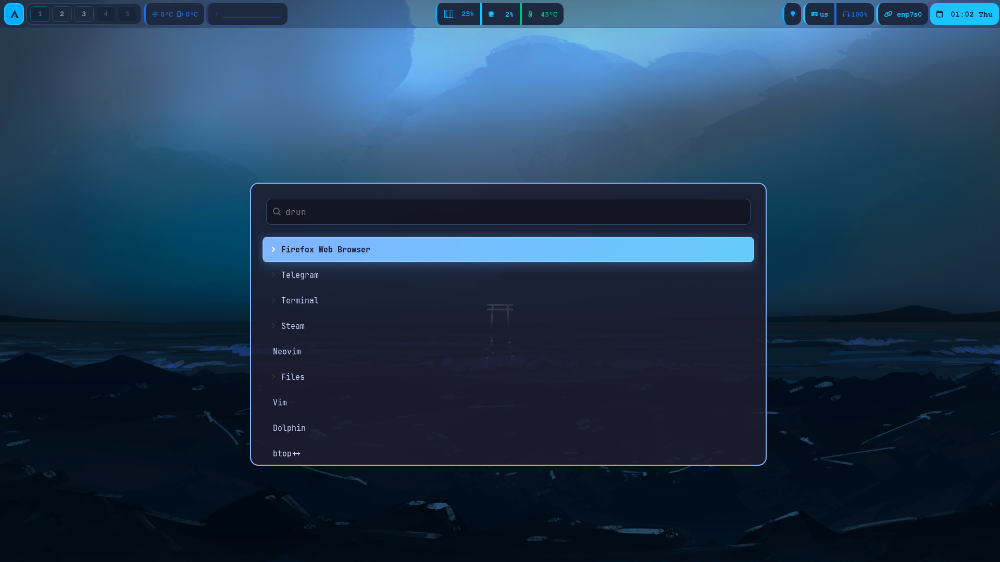

# Winter Hyprland Rice

> *A winter evening themed Hyprland rice with heavy blur effects and icy color palette*

---

## ✨ Features

### 🎨 **Visual Style**
- **Color Scheme**: Frozen blues with silver accents and snow highlights
- **Blur Effects**: Heavy frost-like blur for immersive experience
- **Icons**: Papirus Dark theme

### 🛠️ **Components**
- **Window Manager**: Hyprland
- **Status Bar**: Waybar with winter-themed modules
- **Terminal**: Kitty with Nerd Font
- **Launcher**: Wofi with transparency and blur
- **Audio Visualizer**: Cava with frosty colors
- **Fetch Tool**: Fastfetch with custom ASCII art

### Waybar

a cool waybar from https://github.com/Zilero232/arch-install-kit
but with the colors in the winter style

### Wofi

Made it transparent with blur and winter colors.

## 🚀 Installation

### Quick Start

