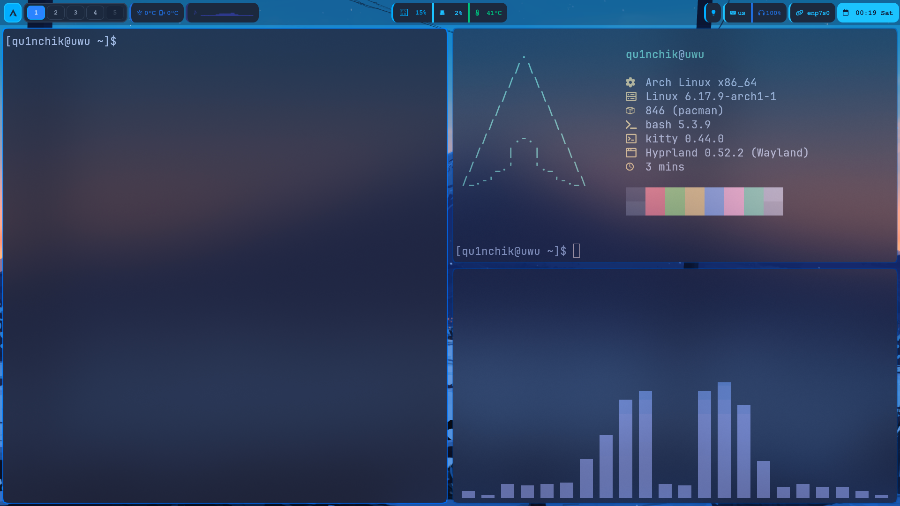
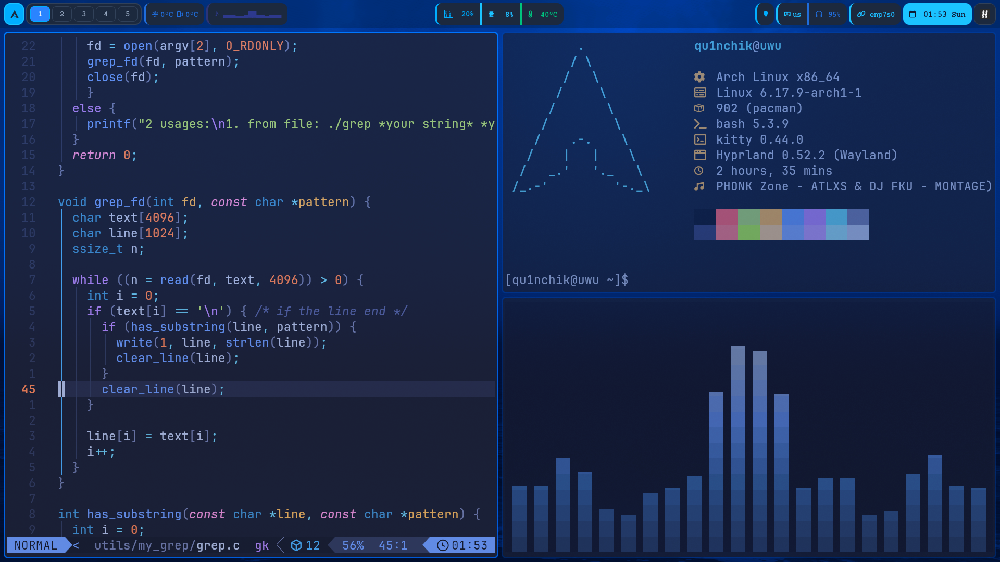
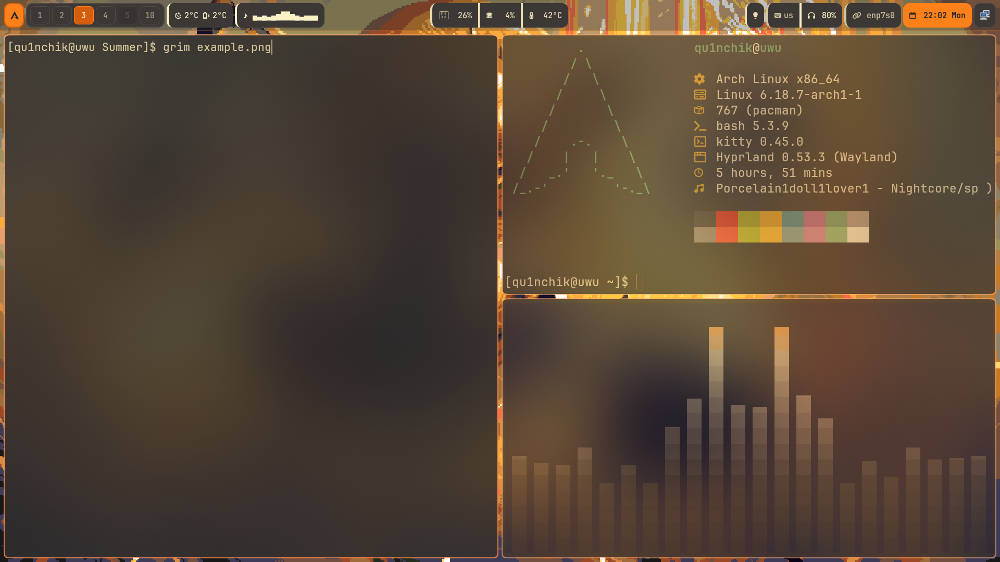

# ❄️ Dotfiles for Hyprland | Two Complete Rices

Two fully-configured, atmospheric desktop setups ("rices") for the Hyprland Wayland compositor, delivered through a unified installer. Each version is a cohesive theme, from the terminal to the cursor, designed for a specific mood.

---

## 🖼️ The Rices

### ❄️ Winter


> A clean and minimal theme inspired by a quiet winter evening, featuring a frosty blue color palette and heavy blur effects for an immersive, soft experience.

**Key Components:**
*   **Hyprland:** Configured with frost-like blur effects.
*   **Waybar:** A custom, cool status bar adapted with winter colors.
*   **Kitty:** Terminal using a Nerd Font, themed to match.
*   **Application Launcher:** Wofi styled with transparency, blur, and winter colors.
*   **Audio Visualizer:** Cava configured with icy, frosty colors.
*   **System Info:** Fastfetch with custom ASCII art.

### 🌙 Ambient


> A dark, smooth, and cozy theme designed for focus during long sessions. It uses a deep, muted color palette with subtle accents.

**Key Components:**
*   **Hyprland:** Configured for a smooth, cohesive dark experience.
*   **Waybar:** A clean, functional status bar with a dark theme.
*   **Kitty:** Terminal themed to complement the overall dark aesthetic.
*   **Application Launcher:** Wofi with a dark, transparent style.
*   **Audio Visualizer:** Cava with deep, ambient color waves.
*   **Editor:** Neovim with a personalized setup and a dark color scheme.

### ☀️ Summer


> A warm and vibrant theme freshly added! Built around the beloved Gruvbox color palette, this rice brings the heat with earthy oranges, warm yellows, and soft greens. Perfect for bright, productive sessions with a cozy retro vibe.

**Key Components:**
*   **Hyprland:** Configured with the warm and distinctive Gruvbox palette throughout the compositor.
*   **Waybar:** A stylish status bar adapted to match the Summer/Gruvbox aesthetic.
*   **Kitty:** Terminal using the Gruvbox Material theme for a perfect color match.
*   **Application Launcher:** Wofi styled with warm colors and subtle transparency.
*   **Audio Visualizer:** Cava configured with warm, earthy color waves that pulse with your music.
*   **Editor:** Neovim fully configured with the Gruvbox Material color scheme.


---

## 🚀 One-Click Installation

The entire setup is automated with a Python installer script for maximum convenience.

1.  **Clone the repository:**
    ```bash
    git clone https://github.com/qu1nchik/my-dotfiles-hyprland
    cd my-dotfiles-hyprland
    ```

2.  **Run the installer:**
    ```bash
    python3 src/install.py
    ```

3.  **Make your choice:** In the interactive menu, select `❄️ Winter` or `🌙 Ambient`.

4.  **Reboot and enjoy!** After the script finishes, reboot your system to fully enjoy your new Hyprland rice.

> **Note:** The installer automatically creates backups of your existing configuration files in `~/.config-backup/`.

---

## 🛠️ Technical Overview

| Component | Winter Rice | Ambient Rice | Summer Rice |
| :--- | :--- | :--- | :--- |
| **WM / Compositor** | Hyprland (Heavy Blur) | Hyprland (Smooth) | Hyprland (Gruvbox Palette) |
| **Status Bar** | Themed Waybar | Themed Waybar | Themed Waybar (Gruvbox) |
| **Terminal** | Kitty(Catppuccin-Macchiato) | Kitty(tokyonight-moon) | Kitty (Gruvbox Material) |
| **Launcher** | Wofi (Transparent/Blur) | Wofi (Dark) | Wofi (Gruvbox Style) |
| **Visualizer** | Cava (Frosty) | Cava (Ambient) | Cava (Warm/Gruvbox) |
| **Fetch Tool** | Fastfetch (Custom Art) | - | - |
| **Editor** | Neovim(Catppuccin-Macchiato) | Neovim (tokyonight-moon) | Neovim (Gruvbox Material) |
| **Icons** | Papirus Dark | - | - |
| **Terminal Multiplexer** | Zellij(Catppuccin-Macchiato) | Zellij(tokyonight-night) | - |
---

## 📁 Repository Structure

```bash
my-dotfiles-hyprland/
├── src/
│   └── install.py          # Main Python installer (now with 3 choices!)
├── Winter/                 # Complete Winter rice configs
│   ├── hypr/
│   ├── waybar/
│   ├── wofi/
│   ├── kitty/
│   └── ... (other configs)
├── Ambient/                # Complete Ambient rice configs
│   ├── hypr/
│   ├── waybar/
│   ├── nvim/
│   ├── kitty/
│   └── ... (other configs)
├── Summer/                 # Complete Summer rice configs
│   ├── hypr/               # Hyprland with warm orange colors
│   ├── waybar/             # Gruvbox-styled status bar
│   ├── kitty/              # Kitty with Gruvbox Material theme
│   ├── nvim/               # Neovim with Gruvbox Material
│   ├── wofi/               # Gruvbox-style launcher              
│   └── ... (other configs)
└── README.md
```

---
**Crafted with attention to detail.** Happy ricing! ✨
